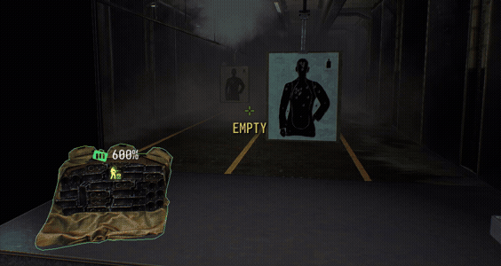
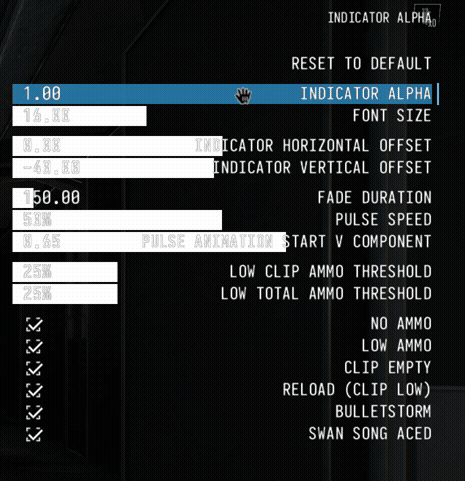

# Low Ammo Text

## About

This is a mod displaying a warning when the ammo is low, (in bulletstorm, in swan song, etc.) like so:

It's also customizable, allowing to set font size, alpha, duration, etc.:

It supports [SuperBLT](https://superblt.znix.xyz/)'s
[auto-updates](https://superblt.znix.xyz/doc/mod_definition/updates/).

## Planned features

 - [ ] Implement color customization.
Consider using [ColorPicker](https://github.com/offyerrocker/PD2-ColorPicker)
 - [ ] Implement dynamically changing colors depending on state.
 For example, make `RELOAD` text more red when running out of ammo in a magazine.
